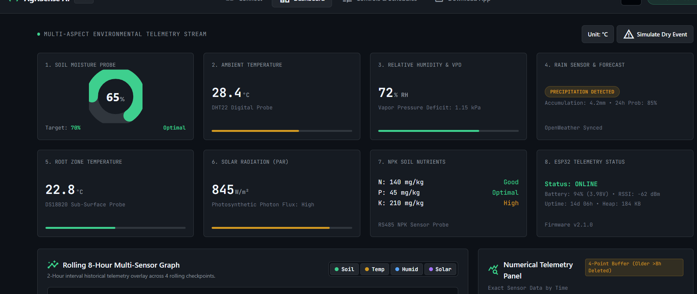
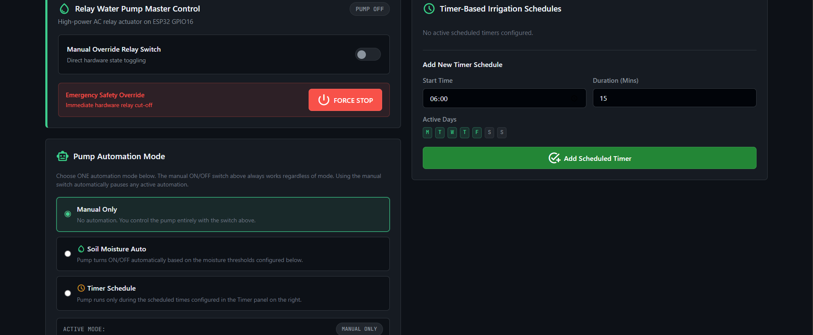
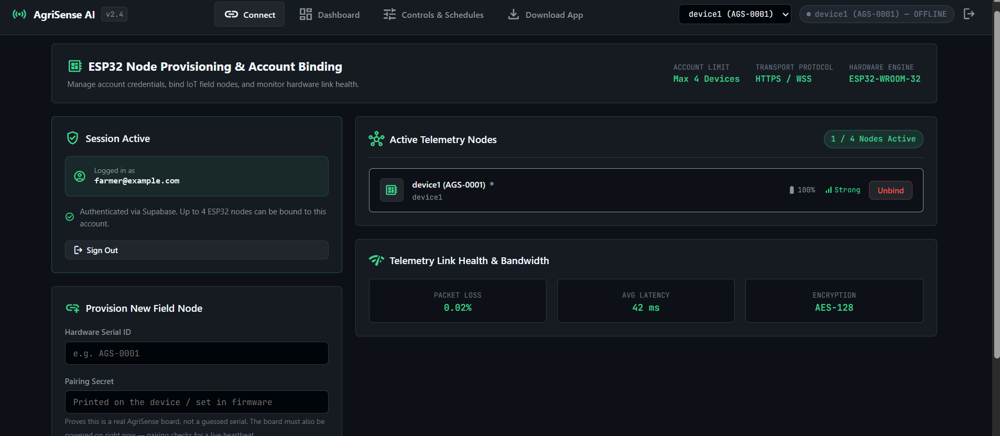
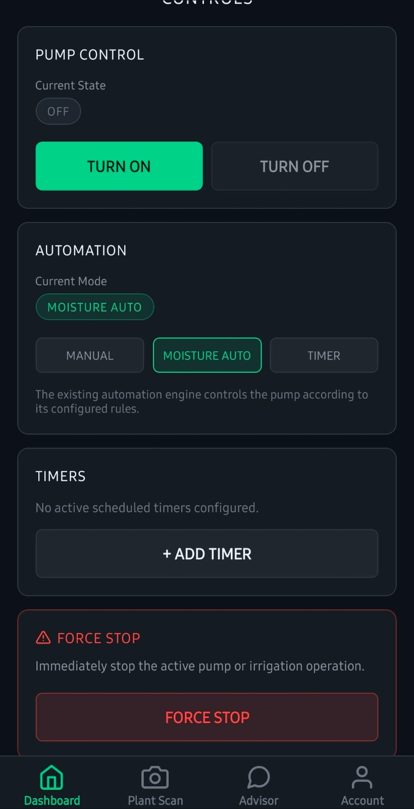
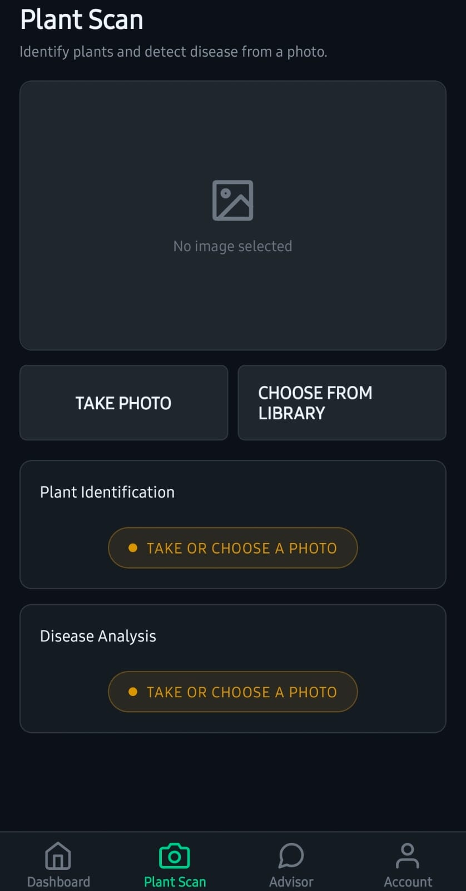
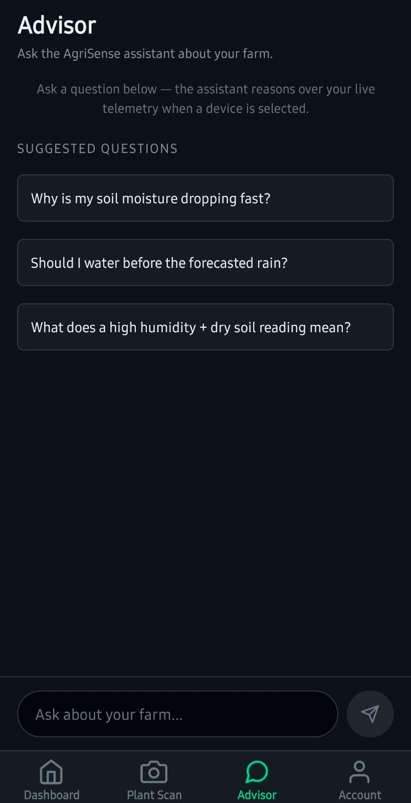
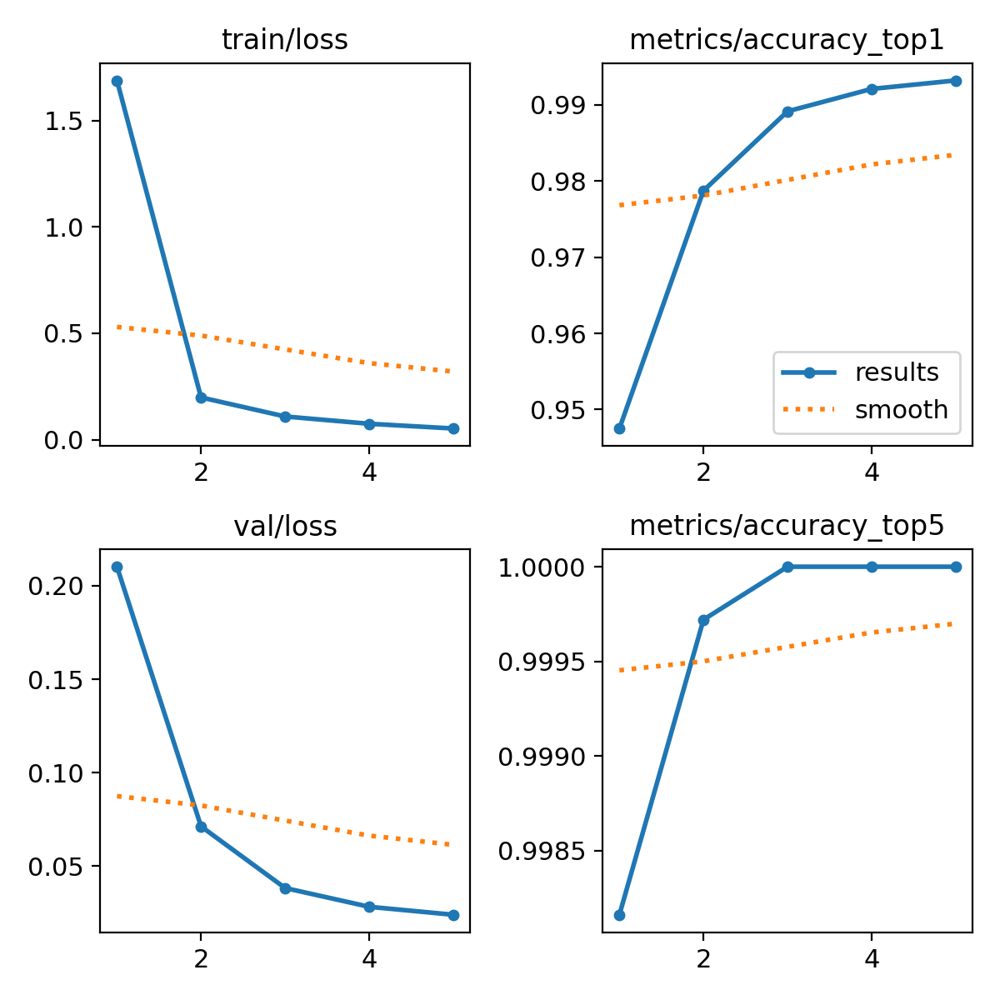
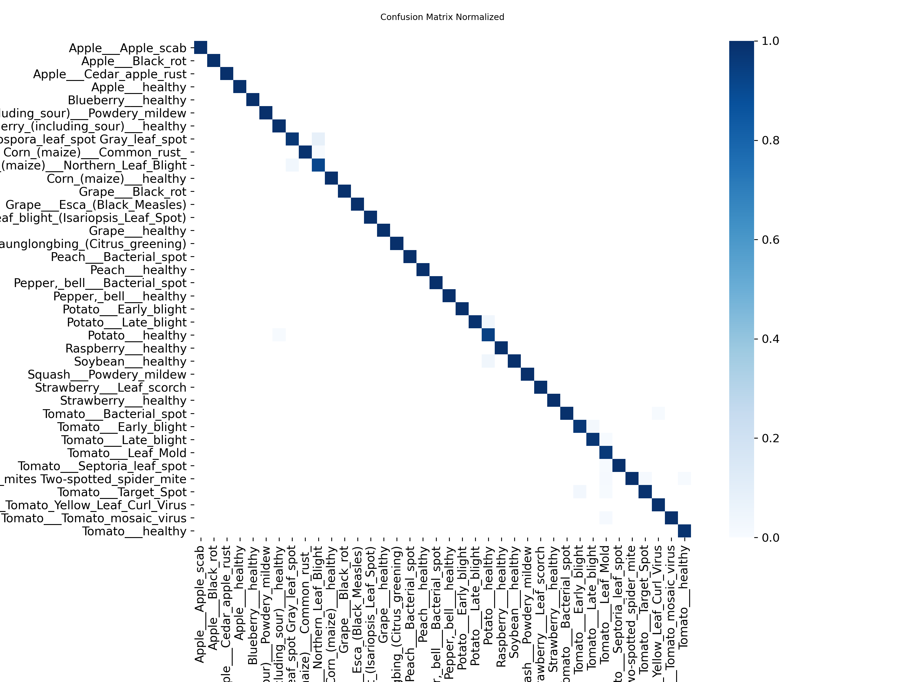

# 🌱 AgriSense AI

**An AI-Powered Smart Agriculture Decision Support System**


AgriSense AI unifies IoT sensor telemetry, automated irrigation, plant disease
detection and LLM reasoning into one system. Farmers monitor field conditions live,
irrigation runs itself, a leaf photo returns a diagnosis, and a chat assistant answers
questions grounded in that farm's actual sensor readings.

<p align="center">
  
</p>

---

## ✨ What it does

### 📡 Live environmental monitoring
Temperature, humidity, soil moisture and rainfall from the field, every 10 seconds.
The ESP32 writes **directly to Supabase**; clients subscribe via Supabase Realtime, so
telemetry and manual pump control keep working even with the backend stopped.

### 💧 Automated irrigation
Decided in two places. **The board decides for itself** every 10 s, so watering keeps
working with Wi-Fi, Supabase or the backend all down — dry soil and no rain starts the
pump, wet soil or rain stops it. A backend decision engine additionally offers timer
schedules and its own moisture thresholds, queued as commands.

Sensor rules always outrank a manual command: rain, wet soil, or a disconnected probe
force the pump off even against a PUMP_ON from the dashboard, and a force-stop holds.
Two hard limits apply regardless — a 15 min max-runtime cutoff and a 30 min cooldown
after it, so a mis-calibrated probe can't cycle the pump forever.

A safety gate comes first: a failed soil probe reports `0` rather than skipping a tick,
so without the gate a disconnected probe reading `0` would satisfy `soil < threshold`
forever and run the pump continuously. The pump logic is asserted at boot against 11
cases with no hardware attached.

<p align="center">
  
</p>

### 🍃 Plant disease detection
Photograph a leaf, get back species, condition, severity, affected area %, symptoms,
likely cause, treatment and prevention steps.

The backend selects its inference source at request time: the trained ONNX model
service when `PLANT_API_URL` is configured, otherwise **Gemini vision** with a strict
JSON response schema. See [Model status](#-model-status) below.

### 🎥 Live field camera
A separate ESP32-CAM streams the field to the app and dashboard. Frames relay through
the backend rather than the local network, so the feed works from **any** network with
no router or port-forwarding setup.

### 🧠 Context-aware farm advisor
A chat assistant that receives the device's latest telemetry in its system instruction,
so answers reflect current field conditions. The Plant Scan screen can hand a diagnosis
straight into the chat.

### 🔐 Device and account security
Devices pair with a serial + secret, gated on the board being powered on at pairing
time. Row-level security scopes every table to the owning account, up to 4 devices each.
All API keys stay server-side — clients call this backend, never the upstream provider.

<p align="center">
  
</p>

### 📱 Mobile app

| Dashboard controls | Plant Scan | Farm Advisor |
|---|---|---|
|  |  |  |

---

## 🏗️ Architecture

The important decision: **the ESP32 talks directly to Supabase, not through the
backend.** The backend is required only for pump automation, plant diagnosis, the
advisor and the camera relay.

```text
ESP32 DevKit V1                Supabase (Postgres)          App / Dashboard
  DHT11    GPIO 4  ─┐
  Soil     GPIO 34 ─┼─► telemetry_data  ──── Realtime ────►  live UI
  Rain     GPIO 33 ─┘    device_status
  Relay    GPIO 16 ◄──── device_commands ◄─────────────────  pump control
                                 ▲
                                 │ service-role
                        ┌────────┴────────┐
ESP32-CAM ──JPEG──────► │ FastAPI backend │ ──► Gemini (vision + advisor chat)
          ◄─"wanted"──  │  backend/main.py│ ──► ONNX model service (when trained)
          ──MJPEG─────► └─────────────────┘
```

| Layer | Directory | Stack |
|---|---|---|
| Sensor firmware | `esp32_firmware/AgriSense_ESP32/` | ESP32 DevKit V1, Arduino C++ |
| Camera firmware | `esp32_firmware/AgriSense_ESP32CAM/` | AI-Thinker ESP32-CAM |
| Backend API | `backend/` | Python 3.11, FastAPI, deployed on Render |
| Web dashboard | `web_dashboard/` | Vanilla HTML/CSS/JS, served by the backend |
| Mobile app | `mobile_app/` | Expo 54, expo-router, React Native, TypeScript |
| Database & auth | Supabase | PostgreSQL, Auth, Realtime, RLS |
| ML training | `ml/` | Ultralytics YOLO11-cls, ONNX export |
| ML serving | `serving/` | FastAPI + onnxruntime |

Full walkthrough: **[documents/WORKFLOW.md](documents/WORKFLOW.md)**

---

## 🔩 Hardware

Two separate boards — they are not wired together, they just share Wi-Fi.

**Sensor node** (ESP32 DevKit V1):

| Component | Pin | Note |
|---|---|---|
| DHT11 (temp + humidity) | GPIO 4 | needs 10k pull-up |
| Soil moisture AOUT | GPIO 34 | ADC1, input-only |
| Rain sensor DO | GPIO 33 | active-LOW |
| Relay IN | GPIO 16 | active-LOW (LOW = pump ON) |

**Camera node** (AI-Thinker ESP32-CAM) — must be a second board: the OV2640 interface
occupies GPIO 34 (the soil ADC), GPIO 4 (flash LED) and GPIO 16 (PSRAM CS), and leaves
no ADC1 pin free.

Full pin-by-pin wiring, relay power supply notes, and a step-by-step relay
diagnosis table: **[esp32_firmware/WIRING_GUIDE.md](esp32_firmware/WIRING_GUIDE.md)**

---

## 📊 Results

A trained baseline lives in the repo, not just a promise of one —
[`ml/artifacts/results_and_accuracy/`](ml/artifacts/results_and_accuracy/):

| | |
|---|---|
| Model | `yolo11n-cls`, 224px input, seed 42 |
| Dataset | PlantVillage — 38 `Species___Condition` classes |
| Split | 43,444 train / 10,861 val images |
| Epochs | 5 |
| **Validation top-1** | **99.32%** |
| **Validation top-5** | **100%** |

<p align="center">
  
  
</p>

**Read this number honestly.** PlantVillage is lab imagery — single detached
leaves on plain backgrounds — so accuracy here runs high and does **not**
transfer to field photos. That gap is exactly why `ml/configs/paths.yaml` holds
PlantDoc out as a real-world evaluation-only set (see
[documents/DATASETS.md](documents/DATASETS.md)). This baseline exists to prove
the training → export → serving path works end to end with real numbers, not
to claim field-ready accuracy.

Reproduce it yourself in ~15 minutes on a free Colab GPU:
[`ml/notebooks/AgriSense_Minimal_Train_Colab.ipynb`](ml/notebooks/AgriSense_Minimal_Train_Colab.ipynb).

---

## 🧠 Model status

Honest summary, because it's easy to conflate "a model exists" with "the model
in the app":

- **The deployed Plant Scan runs on Gemini vision**, not the classifier above.
  `PLANT_API_URL` / `PLANT_API_KEY` are unset, so `/api/plant/predict` uses the
  LLM fallback with a strict JSON response schema.
- **The baseline above is a single-stage species classifier**, not the
  production two-stage pipeline. `serving/pipeline_runtime.py` expects
  `registry.json` plus separate `stage1/species.onnx` and
  `stage2/<species>.onnx` models, written by
  `ml/src/agrisense_pd/export/registry.py`. This combined classifier does not
  have that structure, so it does not drop into `serving/` as-is.
- **The full two-stage pipeline is built but not run to completion.**
  Acquisition, deduplication against the held-out test set, taxonomy
  unification, two-stage training, ONNX export and serving all exist in `ml/`
  and `serving/` — training it needs ~13 GB of data and a GPU budget beyond
  what a free Colab tier gives in one sitting.

Swapping the trained model in is an environment change, not a code change: run
[`ml/notebooks/AgriSense_PlantDisease_Colab.ipynb`](ml/notebooks/AgriSense_PlantDisease_Colab.ipynb),
deploy `serving/`, set `PLANT_API_URL` + `PLANT_API_KEY` on the backend, done.

---

## 🚀 Getting started

### Backend

```bash
cd backend
pip install -r requirements.txt
cp .env.example .env        # then fill in the values
uvicorn main:app --reload   # dashboard served at http://localhost:8000/
```

Required: `SUPABASE_URL`, `SUPABASE_ANON_KEY`, `SUPABASE_SERVICE_KEY`.
Optional: `GEMINI_API_KEY` (plant scan + advisor), `CAM_UPLOAD_KEY` (live camera),
`PLANT_API_URL`/`PLANT_API_KEY` (trained model). Each optional feature returns 503
without its key; everything else keeps working.

### Mobile app

```bash
cd mobile_app
npm install
cp .env.example .env        # set EXPO_PUBLIC_BACKEND_URL to your backend
npx expo start
```

### Database

Run `documents/Supabase_Complete_Setup.md`, then
`documents/supabase_presence_and_pairing.sql` in the Supabase SQL editor.

### Firmware

Open the `.ino` in Arduino IDE, edit the CONFIGURATION block at the top (Wi-Fi
credentials, device ID, and `CAM_UPLOAD_KEY` for the camera), select the board
(`ESP32 Dev Module` / `AI Thinker ESP32-CAM`), upload.

---

## 🧪 Tests

```bash
cd backend && python test_plant_predict.py && python test_camera.py
cd ml && python -m pytest tests/       # 31 passed
cd mobile_app && npx tsc --noEmit
```

---

## 📚 Documentation

- **[WORKFLOW.md](documents/WORKFLOW.md)** — how the whole system fits together
- **[DATASETS.md](documents/DATASETS.md)** — every dataset, licence, and why
- **[Supabase_Complete_Setup.md](documents/Supabase_Complete_Setup.md)** — schema and RLS
- **[WIRING_GUIDE.md](esp32_firmware/WIRING_GUIDE.md)** — pin-by-pin hardware wiring
- **[ml/README.md](ml/README.md)** — training pipeline, phase by phase

---
*AgriSense AI — Cultivating intelligence for the modern smallholder farm.*
